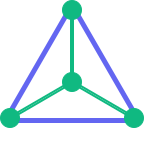
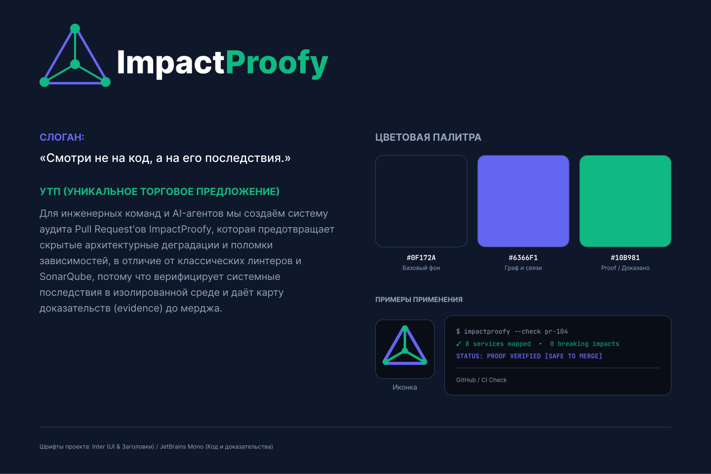

# Практическое занятие №1: Товарный знак и брендирование
**Дисциплина:** Стартап в информационных технологиях  
**Институт:** Институт перспективных технологий и индустриального программирования  
**Кафедра:** Кафедра индустриального программирования  
**Преподаватель:** Адышкин Сергей Сергеевич  
**Семестр:** 1 семестр, 2025–2026 гг.  
**Проект:** ImpactProofy  

---

## 1. Наименование и слоган стартапа

### **Название проекта:** **ImpactProofy**
* **Слоган:** 
  > *Смотри не на код, а на его последствия.*
  *(Англоязычная адаптация: See beyond the diff. Prove the impact.)*
* **Краткое позиционирование:**  
  > *ImpactProofy — предиктивная система аудита архитектурного и системного воздействия изменений (PR / AI-generated code) в изолированных средах с предоставлением верифицируемых доказательств.*

---

## 2. Уникальное торговое предложение (УТП)

Для инженерных команд и AI-агентов мы создаём систему аудита Pull Request'ов ImpactProofy, которая предотвращает скрытые архитектурные деградации и поломки зависимостей, в отличие от классических линтеров и SonarQube, потому что верифицирует системные последствия в изолированной среде и даёт карту доказательств (evidence) до мерджа.

---

## 3. Концепция логотипа:

## 4. Brand Board (Цветовая палитра и примеры применения):

